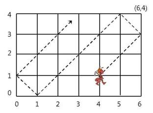

# Python

## baek 10158 개미

https://www.acmicpc.net/problem/10158


> python3 68ms


* 문제

  > 가로 길이가 w이고 세로 길이가 h인 2차원 격자 공간이 있다. 이 격자는 아래 그림처럼 왼쪽 아래가 (0,0)이고 오른쪽 위가 (w,h)이다. 이 공간 안의 좌표 (p,q)에 개미 한 마리가 놓여있다. 개미는 오른쪽 위 45도 방향으로 일정한 속력으로 움직이기 시작한다. 처음에 (p,q)에서 출발한 개미는 1시간 후에는 (p+1,q+1)로 옮겨간다. 단, 이 속력으로 움직이다가 경계면에 부딪치면 같은 속력으로 반사되어 움직인다.
  >
  > 
  >
  > 위 그림은 6×4 격자에서 처음에 (4,1)에서 출발한 개미가 움직인 길을 보여주고 있다. 처음에 (4,1)에 있는 개미는 2시간 후에 (6,3)에 있으며 8시간 후에 (0,1)에 있다. 만일 그 개미가 처음에 (5,3)에 있었다면 매 시간마다 (6,4), (5,3), (4,2), (3,1)로 움직인다. 
  > 
  > 여러분은 크기 w×h인 격자 공간에서 처음에 (p,q)에서 출발하는 개미의 t시간 후의 위치 (x,y)를 계산하여 출력해야 한다. 개미는 절대 지치지 않고 같은 속력으로 이동한다고 가정한다. 
  > 
  > 문제에서 w와 h는 자연수이며 범위는 2 ≤ w,h ≤ 40,000이다. 그리고 개미의 초기 위치 p와 q도 자연수이며 범위는 각각 0 < p < w과 0 < q < h이다. 그리고 계산할 시간 t의 범위는 1 ≤ t ≤ 200,000,000이다. 
  
* 입력

  > 첫줄에는 w와 h가 공백을 사이에 두고 주어진다. 그 다음 줄에는 초기 위치의 좌표값 p와 q가 공백을 사이에 두고 주어진다. 3번째 줄에는 개미가 움직일 시간 t가 주어진다. 
  >
  > ```bash
  > 6 4
  > 4 1
  > 8
  > ```

* 출력

  > 출력은 t 시간 후에 개미의 위치 좌표 (x,y)의 값 x와 y를 공백을 사이에 두고 출력한다. 
  >
  > ```bash
  > 0 1
  > ```


```python
import sys
input = sys.stdin.readline

w, h = map(int, sys.stdin.readline().split()) # 가로 길이 세로 길이
p, q = map(int, sys.stdin.readline().split()) # 현재 가로 위치 세로 위치
t = int(sys.stdin.readline()) # 시간

print(((p+t) % w) if ((p+t) // w) % 2 == 0 else w - ((p+t) % w), ((q+t) % h) if ((q+t) // h) % 2 == 0 else h - ((q+t) % h))

# '//'는 나눴을 때 몫을 나타내는 기호

# 현재 가로 위치와 시간을 더했는데 지도의 가로위치로 나눴을 때 짝수면 
# 현재 가로 위치와 시간을 더한 것을 가로로 나눠 주면 답이 나온다.
# 나눴을 때 홀수가 나온다면 지도의 가로 길이에서
# 현재 가로 위치와 시간을 더한 것을 총 지도 길이로 나눴을 때의 나머지를 빼줘야 한다.
```

> 이정도면 거의 숏코딩 아니냐구우,,,
>
> 진짜,, 꼬박 며칠을 계속 디버깅해보고, 반례 찾아보고 열심히 풀었다 ㅜㅜ 고작 실버5인데 이렇게 시간 쓴 게 사실 좀 억울하기도 하고, 이것 때문에 어제 잔디밭을 못 채운 게 아쉽기도 한데 그래도 내가 끝끝내 풀었다는 것이 가장 중요하다


* 모범답안

  ```python
  
  ```
  
  > 
  >