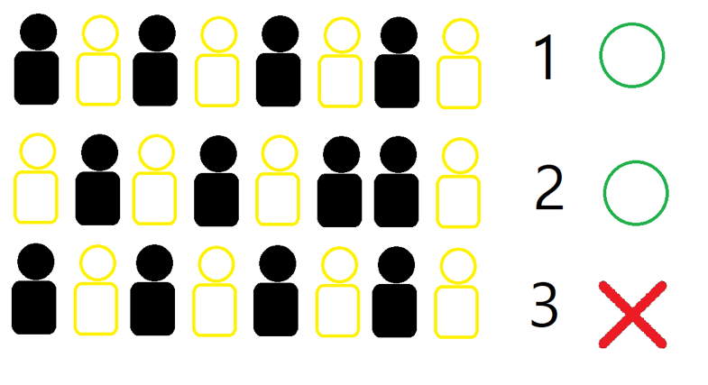

# python

## baek 14719 빗물 골드5

https://www.acmicpc.net/problem/14719

> python3 96ms
>
> pypy3 124ms


* 문제

  > 2차원 세계에 블록이 쌓여있다. 비가 오면 블록 사이에 빗물이 고인다.
  >
  > 
  >
  > 비는 충분히 많이 온다. 고이는 빗물의 총량은 얼마일까?
  
* 입력

  > 첫 번째 줄에는 2차원 세계의 세로 길이 H과 2차원 세계의 가로 길이 W가 주어진다. (1 ≤ H, W ≤ 500)
  >
  > 두 번째 줄에는 블록이 쌓인 높이를 의미하는 0이상 H이하의 정수가 2차원 세계의 맨 왼쪽 위치부터 차례대로 W개 주어진다.
  > 
  > 따라서 블록 내부의 빈 공간이 생길 수 없다. 또 2차원 세계의 바닥은 항상 막혀있다고 가정하여도 좋다.
  > 
  > ```python
  > 4 8
  > 3 1 2 3 4 1 1 2
  > ```
  > 
  
* 출력

  > 2차원 세계에서는 한 칸의 용량은 1이다. 고이는 빗물의 총량을 출력하여라.
  >
  > 빗물이 전혀 고이지 않을 경우 0을 출력하여라.
  >
  > ```python
  > 5
  > ```


```python
def sol():

    h, w = map(int, input().split())
    arr = list(map(int, input().split()))

    result = 0

    for i in range(h):
        # 한 줄 한 줄 올라가며 더해줄 것.
        startflag, water = 0, 0
        # 빗물 웅덩이가 받아지는지 계산하라는 flag와 빗물 카운트를 계산할 변수
        for j in range(w):
        # 하나의 열 씩 진행해 나아가며
            if startflag:
            # 기둥이 존재한다면
                if arr[j] <= i:
                # 현재 위치에 기둥이 더 낮다면
                    water += 1
                    # 한 칸의 물이 고임
                else:
                # 만약 물웅덩이 계산 중이고, 고인 물이 끝이 날 것 같다면
                    result += water
                    water = 0
            else:
                if arr[j] > i:
                # 만약 기둥이 없는데 현재 세워질 기둥이 현재 계산하는 높이보다 크다면
                    startflag = 1
                    # 이 다음부터 웅덩이 계산할거임 flag 1
    print(result)


sol()
```

> 약간 코드가 난잡하고 정리가 잘 안되어 있는 느낌이다
>
> 의식의 흐름대로 문제를 풀다보니 그런듯. 조금 더 문제를 통찰하며 푸는 습관이 필요함.

* 모범답안

  ```python
  H,W=map(int,input().split())
  A=list(map(int,input().split()))
  M=[]
  m = -1
  for i in range(len(A)-1,-1,-1):
  	if m < A[i]: m = A[i]
  	M = [m] + M
  
  R = 0
  m = A[0]
  for i in range(1, len(A)-1):
  	t = min(m, M[i]) - A[i]
  	if t > 0: R += t
  	if m < A[i]: m = A[i]
  print(R)
  ```

  > - __M = [m] + M__ : 이렇게 appendleft를 할 수 있구나..
  >
  > 캬 왜 이런 생각을 못했징. 뒤에서부터 계산했을 때 최댓값과 앞에서부터 계산했을 때의 최댓값 중의 최솟값에서 현재 기둥의 높이를 뺀다. 그게 0보다 크면 덧셈하고, 만약 기둥이 높아졌을 시 앞에서부터의 최댓값을 갱신.

