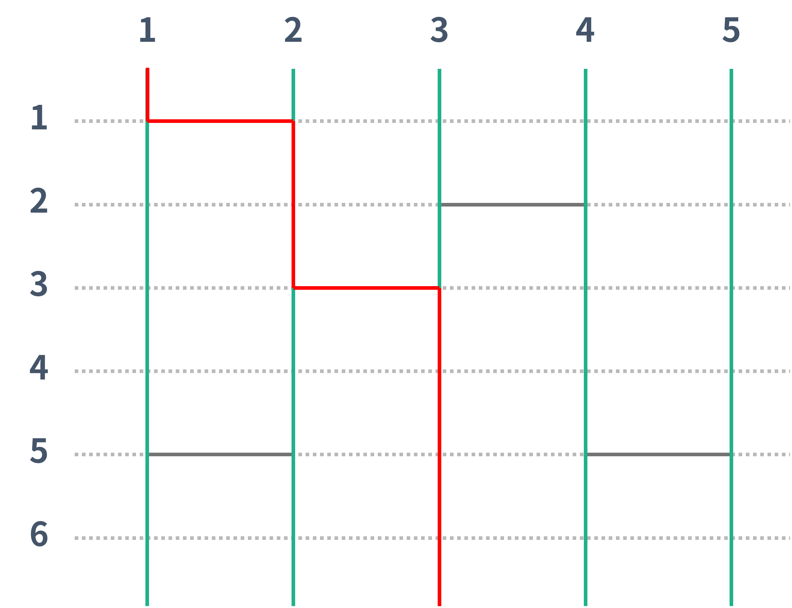
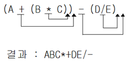

# Python

## baek 14500 테트로미노

https://www.acmicpc.net/problem/14500


> python3 136ms
>
> pypy3 168ms


* 문제

  > 스타트링크의 사무실은 1×1크기의 정사각형으로 나누어져 있는 N×M 크기의 직사각형으로 나타낼 수 있다. 사무실에는 총 K개의 CCTV가 설치되어져 있는데, CCTV는 5가지 종류가 있다. 각 CCTV가 감시할 수 있는 방법은 다음과 같다.
  >
  > |  |  |  |  |  |
  > | ----------------------- | ----------------------- | ----------------------- | ----------------------- | ----------------------- |
  > | 1번                     | 2번                     | 3번                     | 4번                     | 5번                     |
  >
  > 1번 CCTV는 한 쪽 방향만 감시할 수 있다. 2번과 3번은 두 방향을 감시할 수 있는데, 2번은 감시하는 방향이 서로 반대방향이어야 하고, 3번은 직각 방향이어야 한다. 4번은 세 방향, 5번은 네 방향을 감시할 수 있다.
  >
  > CCTV는 감시할 수 있는 방향에 있는 칸 전체를 감시할 수 있다. 사무실에는 벽이 있는데, CCTV는 벽을 통과할 수 없다. CCTV가 감시할 수 없는 영역은 사각지대라고 한다.
  >
  > CCTV는 회전시킬 수 있는데, 회전은 항상 90도 방향으로 해야 하며, 감시하려고 하는 방향이 가로 또는 세로 방향이어야 한다.
  >
  > ```
  > 0 0 0 0 0 0
  > 0 0 0 0 0 0
  > 0 0 1 0 6 0
  > 0 0 0 0 0 0
  > ```
  >
  > 지도에서 0은 빈 칸, 6은 벽, 1~5는 CCTV의 번호이다. 위의 예시에서 1번의 방향에 따라 감시할 수 있는 영역을 '`#`'로 나타내면 아래와 같다.
  >
  > | `0 0 0 0 0 0 0 0 0 0 0 0 0 0 1 # 6 0 0 0 0 0 0 0` | `0 0 0 0 0 0 0 0 0 0 0 0 # # 1 0 6 0 0 0 0 0 0 0` | `0 0 # 0 0 0 0 0 # 0 0 0 0 0 1 0 6 0 0 0 0 0 0 0` | `0 0 0 0 0 0 0 0 0 0 0 0 0 0 1 0 6 0 0 0 # 0 0 0` |
  > | ------------------------------------------------- | ------------------------------------------------- | ------------------------------------------------- | ------------------------------------------------- |
  > | →                                                 | ←                                                 | ↑                                                 | ↓                                                 |
  >
  > CCTV는 벽을 통과할 수 없기 때문에, 1번이 → 방향을 감시하고 있을 때는 6의 오른쪽에 있는 벽을 감시할 수 없다.
  >
  > ```
  > 0 0 0 0 0 0
  > 0 2 0 0 0 0
  > 0 0 0 0 6 0
  > 0 6 0 0 2 0
  > 0 0 0 0 0 0
  > 0 0 0 0 0 5
  > ```
  >
  > 위의 예시에서 감시할 수 있는 방향을 알아보면 아래와 같다.
  >
  > | `0 0 0 0 0 # # 2 # # # # 0 0 0 0 6 # 0 6 # # 2 # 0 0 0 0 0 # # # # # # 5` | `0 0 0 0 0 # # 2 # # # # 0 0 0 0 6 # 0 6 0 0 2 # 0 0 0 0 # # # # # # # 5` | `0 # 0 0 0 # 0 2 0 0 0 # 0 # 0 0 6 # 0 6 # # 2 # 0 0 0 0 0 # # # # # # 5` | `0 # 0 0 0 # 0 2 0 0 0 # 0 # 0 0 6 # 0 6 0 0 2 # 0 0 0 0 # # # # # # # 5` |
  > | ------------------------------------------------------------ | ------------------------------------------------------------ | ------------------------------------------------------------ | ------------------------------------------------------------ |
  > | 왼쪽 상단 2: ↔, 오른쪽 하단 2: ↔                             | 왼쪽 상단 2: ↔, 오른쪽 하단 2: ↕                             | 왼쪽 상단 2: ↕, 오른쪽 하단 2: ↔                             | 왼쪽 상단 2: ↕, 오른쪽 하단 2: ↕                             |
  >
  > CCTV는 CCTV를 통과할 수 있다. 아래 예시를 보자.
  >
  > ```
  > 0 0 2 0 3
  > 0 6 0 0 0
  > 0 0 6 6 0
  > 0 0 0 0 0
  > ```
  >
  > 위와 같은 경우에 2의 방향이 ↕ 3의 방향이 ←와 ↓인 경우 감시받는 영역은 다음과 같다.
  >
  > ```
  > # # 2 # 3
  > 0 6 # 0 #
  > 0 0 6 6 #
  > 0 0 0 0 #
  > ```
  >
  > 사무실의 크기와 상태, 그리고 CCTV의 정보가 주어졌을 때, CCTV의 방향을 적절히 정해서, 사각 지대의 최소 크기를 구하는 프로그램을 작성하시오.

* 입력

  > 첫째 줄에 사무실의 세로 크기 N과 가로 크기 M이 주어진다. (1 ≤ N, M ≤ 8)
  >
  > 둘째 줄부터 N개의 줄에는 사무실 각 칸의 정보가 주어진다. 0은 빈 칸, 6은 벽, 1~5는 CCTV를 나타내고, 문제에서 설명한 CCTV의 종류이다. 
  >
  > CCTV의 최대 개수는 8개를 넘지 않는다.
  >
  > ```bash
  > 4 6
  > 0 0 0 0 0 0
  > 0 0 0 0 0 0
  > 0 0 1 0 6 0
  > 0 0 0 0 0 0
  > ```

* 출력

  > 첫째 줄에 사각 지대의 최소 크기를 출력한다.
  >
  > ```bash
  > 20
  > ```


```python
'''
3 3
6 0 0
0 3 0
5 0 6
로직 설명
1. 하나의 cctv가 감시할 수 있는 경우의 수를 일차원 배열로 저장.
1-1. 맵을 돌면서 경우의 수를 저장하되, 0일 경우, 0의 개수 카운트.
2. 모든 일차원 배열들을 이차원 배열로 한꺼번에 정리.
3. 그 이차원 배열을 조합 형태로 돌면서 최고로 넓게 감시했을 때의 좌표들 개수 카운트
4. 출력 = 0의 개수 - 최고로 넓게 감시했을 때 좌표의 개수
'''

import sys
input = sys.stdin.readline

dr = (-1, 1) # 상하
dc = (-1, 1) # 좌우


def up(i, j):
    go = set()
    nr, cnt = dr[0] + i, 0
    while 0 <= nr < r and arr[nr][j] != 6:
        if arr[nr][j] == 0:
            go.add((nr, j))
        nr = nr + dr[0]
    return go


def down(i, j):
    go = set()
    nr, cnt = dr[1] + i, 0
    while 0 <= nr < r and arr[nr][j] != 6:
        if arr[nr][j] == 0:
            go.add((nr, j))
        nr = nr + dr[1]
    return go


def left(i, j):
    go = set()
    nc, cnt = dc[0] + j, 0
    while 0 <= nc < c and arr[i][nc] != 6:
        if arr[i][nc] == 0:
            go.add((i, nc))
        nc = nc + dc[0]
    return go


def right(i, j):
    go = set()
    nc, cnt = dc[1] + j, 0
    while 0 <= nc < c and arr[i][nc] != 6:
        if arr[i][nc] == 0:
            go.add((i, nc))
        nc = nc + dc[1]
    return go


def combinations(cnt, maxcctv):
    global result
    if cnt == len(dir):
        result = max(len(maxcctv), result)
        return
    for l in dir[cnt]:
        combinations(cnt + 1, maxcctv | l)


r, c = map(int, input().split())
arr = [list(map(int, input().split())) for _ in range(r)]
dir, zerocnt, result, maxcctv = [], 0, 0, set()

for i in range(r):
    for j in range(c):
        if arr[i][j] == 0:
            zerocnt += 1
        elif arr[i][j] == 1:
            dir.append([up(i,j), down(i,j), left(i, j), right(i, j)])
        elif arr[i][j] == 2:
            dir.append([up(i,j) | down(i,j), left(i, j) | right(i, j)])
        elif arr[i][j] == 3:
            dir.append([up(i, j) | right(i, j), right(i, j) | down(i, j), \
                     down(i, j) | left(i, j), left(i, j) | up(i, j)])
        elif arr[i][j] == 4:
            dir.append([up(i, j) | right(i, j) | left(i, j),\
                     up(i, j) | right(i, j) | down(i, j), \
                     right(i, j) | down(i, j) | left(i, j), \
                     down(i, j) | left(i, j) | up(i, j)])
        elif arr[i][j] == 5:
            dir.append([up(i, j) | down(i, j) | left(i, j) | right(i, j)])

combinations(0, maxcctv)

print(zerocnt - result)


'''
6 5
2 2 6 0 5
0 6 6 0 4
6 6 0 0 0
2 6 4 6 0
6 3 0 0 6
6 4 0 6 6
1

5 6
0 3 0 0 0 0
0 0 0 0 0 0
6 0 0 2 2 0
6 1 2 0 6 6
0 0 6 0 6 6
5

4 4
0 4 0 2
0 0 0 2
0 0 0 0
3 5 0 0
1

3 6
0 5 5 0 2 0
0 0 2 0 0 3
0 0 0 0 0 0
2

3 3
6 0 0
0 3 0
5 0 6
1

'''
```

> 못풀었다.
>
> 모든 경우의 수를 저장하고 조합으로 돌렸어야 했는데 그게 머릿 속으로는 구현이  잘 되지 않았다 ㅜㅜ
>
> 암튼 이문제를 통해 한 번 더 배워간다. 간만에 타인의 코드를 참조했다. 멋지다.


* 모범답안

  ```python
  
  ```

  > 