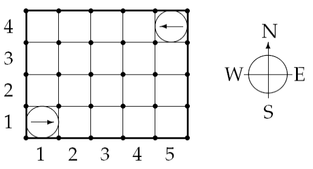

# python

## baek 2174 로봇 시뮬레이션 골드5

https://www.acmicpc.net/problem/2174

> python3 72ms
>


* 문제

  > 가로 A(1≤A≤100), 세로 B(1≤B≤100) 크기의 땅이 있다. 이 땅 위에 로봇들이 N(1≤N≤100)개 있다.
  >
  > 
  >
  > 로봇들의 초기 위치는 x좌표와 y좌표로 나타난다. 위의 그림에서 보듯 x좌표는 왼쪽부터, y좌표는 아래쪽부터 순서가 매겨진다. 또한 각 로봇은 맨 처음에 NWES 중 하나의 방향을 향해 서 있다. 초기에 서 있는 로봇들의 위치는 서로 다르다.
  >
  > 이러한 로봇들에 M(1≤M≤100)개의 명령을 내리려고 한다. 각각의 명령은 순차적으로 실행된다. 즉, 하나의 명령을 한 로봇에서 내렸으면, 그 명령이 완수될 때까지 그 로봇과 다른 모든 로봇에게 다른 명령을 내릴 수 없다. 각각의 로봇에 대해 수행하는 명령은 다음의 세 가지가 있다.
  >
  > 1. L: 로봇이 향하고 있는 방향을 기준으로 왼쪽으로 90도 회전한다.
  > 2. R: 로봇이 향하고 있는 방향을 기준으로 오른쪽으로 90도 회전한다.
  > 3. F: 로봇이 향하고 있는 방향을 기준으로 앞으로 한 칸 움직인다.
  >
  > 간혹 로봇들에게 내리는 명령이 잘못될 수도 있기 때문에, 당신은 로봇들에게 명령을 내리기 전에 한 번 시뮬레이션을 해 보면서 안전성을 검증하려 한다. 이를 도와주는 프로그램을 작성하시오.
  >
  > 잘못된 명령에는 다음의 두 가지가 있을 수 있다.
  >
  > 1. Robot X crashes into the wall: X번 로봇이 벽에 충돌하는 경우이다. 즉, 주어진 땅의 밖으로 벗어나는 경우가 된다.
  > 2. Robot X crashes into robot Y: X번 로봇이 움직이다가 Y번 로봇에 충돌하는 경우이다.
  
* 입력

  > 첫째 줄에 두 정수 A, B가 주어진다. 다음 줄에는 두 정수 N, M이 주어진다. 다음 N개의 줄에는 각 로봇의 초기 위치(x, y좌표 순) 및 방향이 주어진다. 다음 M개의 줄에는 각 명령이 명령을 내리는 순서대로 주어진다. 각각의 명령은 명령을 내리는 로봇, 명령의 종류(위에 나와 있는), 명령의 반복 회수로 나타낸다. 각 명령의 반복 회수는 1이상 100이하이다.
  >
  > ```bash
  > 5 4
  > 2 2
  > 1 1 E
  > 5 4 W
  > 1 F 7
  > 2 F 7
  > ```
  > 
  
* 출력

  > 첫째 줄에 시뮬레이션 결과를 출력한다. 문제가 없는 경우에는 OK를, 그 외의 경우에는 위의 형식대로 출력을 한다. 만약 충돌이 여러 번 발생하는 경우에는 가장 먼저 발생하는 충돌을 출력하면 된다.
  >
  > ```bash
  > Robot 1 crashes into the wall
  > ```


```python
import sys
input = sys.stdin.readline


def sol():
    alpha = ['E', 'S', 'W', 'N']
    go = [[0, 1], [1, 0], [0, -1], [-1, 0]] # E S W N

    a, b = map(int, input().split())
    n, m = map(int, input().split())
    arr = [[0] * a for _ in range(b)]
    robot = [[] for _ in range(n+1)]

    for i in range(n):
        x, y, direction = input().split()
        x,  y = int(x), int(y)
        arr[b-y][x-1] = i+1
        robot[i+1] = [b-y, x-1, alpha.index(direction)]

    for i in range(m):
        idx, order, count = input().split()
        idx, count = int(idx), int(count)
        r, c, d = robot[idx]
        arr[r][c] = 0

        for _ in range(count):
            if order == 'L':
                d = (d - 1) % 4
            elif order == 'R':
                d = (d + 1) % 4
            else:
                r, c = r + go[d][0], c + go[d][1]
                if r < 0 or b <= r or c < 0 or a <= c:
                    print('Robot ' + str(idx) + ' crashes into the wall')
                    exit()
                elif arr[r][c]:
                    print('Robot ' + str(idx) + ' crashes into robot ' + str(arr[r][c]))
                    exit()
                else:
                    continue

        arr[r][c] = idx
        robot[idx] = [r, c, d]

    print('OK')


sol()
```

> 츠암내,, 내가 틀렸던 부분은 그런거다... L이나 R도 F와 마찬가지로 COUNT와 함께 들어오는데, 그걸 간과하고 F에만 FOR문을 넣었었다. 
>
> 그리고 나중에 D를 ROBOT배열에 넣으면서 정작 값을 변경하는 건 D가 아니라 배열 그자체 값이었기 때문에 틀렸을 수 밖에 없다. 바보바보


* 모범답안

  ```python
  60
  
  import sys
  input = sys.stdin.readline
  
  def move(ipt: []):
  	dir = [[1, 0], [0, 1], [-1, 0], [0, -1]]
  	ronum, command, repeat = int(ipt[0]), ipt[1], int(ipt[2])
  
  	if command == 'L':
  		robot[ronum][2] = (robot[ronum][2] - repeat) % 4
  	elif command == 'R':
  		robot[ronum][2] = (robot[ronum][2] + repeat) % 4
  	else:
  		for i in range(repeat):
  			Map[robot[ronum][0]][robot[ronum][1]] = 0
  			for j in range(2):
  				robot[ronum][j] += dir[robot[ronum][2]][j]
  
  			if 0 < robot[ronum][0] <= B and 0 < robot[ronum][1] <= A:
  				if Map[robot[ronum][0]][robot[ronum][1]] == 0:
  					Map[robot[ronum][0]][robot[ronum][1]] = ronum
  				else:
  					print("Robot {0} crashes into robot {1}"\
  						.format(ronum, Map[robot[ronum][0]][robot[ronum][1]]))
  					return False
  			else:
  				print("Robot {0} crashes into the wall".format(ronum))
  				return False
  	
  	return True
  
  A, B = map(int, input().split())
  N, M = map(int, input().split())
  Map = [[0] * (A + 1) for i in range(B + 1)]
  robot, key = [[]], { 'N' : 0, 'E' : 1, 'S' : 2, 'W' : 3 }
  
  for i in range(N):
  	ipt = list(map(str, input().split()))
  	ipt[0], ipt[1], ipt[2] = int(ipt[1]), int(ipt[0]), key[ipt[2]]
  	Map[ipt[0]][ipt[1]] = i + 1
  	robot.append(ipt)
  
  for i in range(M):
  	if not move(list(map(str, input().split()))):
  		break
  	if i == M - 1:
		print("OK")
  ```
  
  > 아 이렇게 풀 수도 있군,,, 
  >
  > - L이나 R과 함께 반복 횟수가 주어졌을 때, 정직하게 for문으로 돌리지 말고,, 한 번에 계산하면 시간을 줄일 수 있다. 
  > - 그리고 바보 가튼넘,,, 지도가 저렇게 꼬여 있을 때는 지도를 아예 뒤집고 나침반도 뒤집어서 생각해야 한다. 
  > - 그리고 index 내장함수로 NESW 인덱스를 찾지 말고,, 딕셔너리로 계산했어야 했다..

