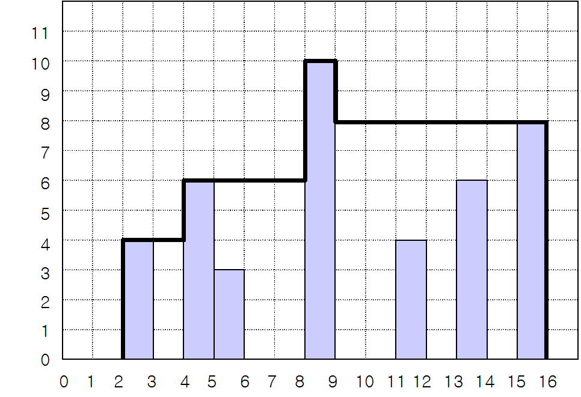

# Python

## baek 2304 창고 다각형 실버2

https://www.acmicpc.net/problem/2304


> python3 116ms


* 문제

  > N 개의 막대 기둥이 일렬로 세워져 있다. 기둥들의 폭은 모두 1 m이며 높이는 다를 수 있다. 이 기둥들을 이용하여 양철로 된 창고를 제작하려고 한다. 창고에는 모든 기둥이 들어간다. 이 창고의 지붕을 다음과 같이 만든다.
  >
  > 1. 지붕은 수평 부분과 수직 부분으로 구성되며, 모두 연결되어야 한다.
  >2. 지붕의 수평 부분은 반드시 어떤 기둥의 윗면과 닿아야 한다.
  > 3. 지붕의 수직 부분은 반드시 어떤 기둥의 옆면과 닿아야 한다.
  > 4. 지붕의 가장자리는 땅에 닿아야 한다.
  > 5. 비가 올 때 물이 고이지 않도록 지붕의 어떤 부분도 오목하게 들어간 부분이 없어야 한다.
  > 
  > 그림 1은 창고를 옆에서 본 모습을 그린 것이다. 이 그림에서 굵은 선으로 표시된 부분이 지붕에 해당되고, 지붕과 땅으로 둘러싸인 다각형이 창고를 옆에서 본 모습이다. 이 다각형을 창고 다각형이라고 하자.
  > 
  > 
  >    그림1 . 기둥과 지붕(굵은 선)의 예
  > 
  >창고 주인은 창고 다각형의 면적이 가장 작은 창고를 만들기를 원한다. 그림 1에서 창고 다각형의 면적은 98 ㎡이고, 이 경우가 가장 작은 창고 다각형이다.
  > 
  >기둥들의 위치와 높이가 주어질 때, 가장 작은 창고 다각형의 면적을 구하는 프로그램을 작성하시오.
  
* 입력

  > 첫 줄에는 기둥의 개수를 나타내는 정수 N이 주어진다. N은 1 이상 1,000 이하이다. 그 다음 N 개의 줄에는 각 줄에 각 기둥의 왼쪽 면의 위치를 나타내는 정수 L과 높이를 나타내는 정수 H가 한 개의 빈 칸을 사이에 두고 주어진다. L과 H는 둘 다 1 이상 1,000 이하이다.
  >
  > ```bash
  > 7
  > 2 4
  > 11 4
  > 15 8
  > 4 6
  > 5 3
  > 8 10
  > 13 6
  > ```

* 출력

  > 첫 줄에 창고 다각형의 면적을 나타내는 정수를 출력한다.
  >
  > ```bash
  > 98
  > ```
  
  

```python
'''
일단 첫번째 왼쪽 면의 위치로 정렬을 하고
두번째 값의 최댓값의 인덱스를 찾는데
그리고 처음부터 최댓값의 인덱스까지 계산하고
뒤에서부터 최댓값의 인덱스까지 계산한다.
'''

n = int(input())
arr = []
for _ in range(n):
    a, b = map(int, input().split())
    arr.append([a, b])

arr = sorted(arr)
idx, h = 0, 0
for i in range(len(arr)):
    if arr[i][1] > h:
        h = arr[i][1]
        idx = i

loc, hei, result = arr[0][0], arr[0][1], 0
for i in range(idx):
    if arr[i][1] > hei:
        result += (arr[i][0] - loc) * hei
        loc, hei = arr[i][0], arr[i][1]

result += (arr[idx][0] - loc) * hei + arr[idx][1]

loc, hei= arr[len(arr) - 1][0], arr[len(arr) - 1][1]
for i in range(len(arr)-1, idx, -1):
    if arr[i][1] > hei:
        result += (loc - arr[i][0]) * hei
        loc, hei = arr[i][0], arr[i][1]

result += (loc - arr[idx][0]) * hei
print(result)
```

> 자바나 c는 for문을 돌 때 i를 계속 증가시키다가 range('숫자') 값에 다다르고 멈춘다. 그 때의 i의 값은 '숫자'의 값이 나오는데, 
>
> 파이썬은 '숫자'의 값보다 1 작은 수가 나온다. 즉, 정직하게 for문을 돌린다는 점.
>
> 명심하자


* 모범답안

  ```python
  import sys
  input = lambda :sys.stdin.readline().rstrip()
  
  max_L = 0
  max_Idx = 0
  max_H = 1
  arr = list()
  for i in range(int(input())):
      idx, height = map(int ,input().split())
      arr.append([idx, height])
  
      if max_L < idx:
          max_L = idx
  
      if max_H < height:
          max_H = height
          max_Idx = idx
  
  list = [0] * (max_L + 1)
  for i, h in arr:
      list[i] = h
  
  tmp = 0
  ans = 0
  for i in range(max_Idx + 1):
      if list[i] > tmp:
          tmp = list[i]
      ans += tmp
  
  tmp = 0
  for i in range(max_L, max_Idx, -1):
      if list[i] > tmp:
          tmp = list[i]
      ans += tmp
  
  print(ans)
  ```

  > 헐 대박이다.
  >
  > * __import sys
  >   input = lambda :sys.stdin.readline().rstrip()__
  >
  > 나랑 왜 시간 차이가 나는지 도무지 이해를 못했는데, 저 식을 쓰고 시간이 거의 반 가까이 줄여졌다. 외우고, 앞으로 백준 풀 때 자주 써먹어야지

