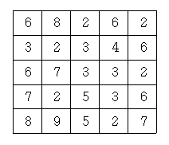
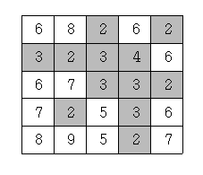
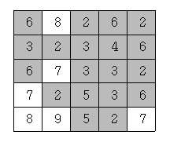

# python

## baek 2468 안전 영역 실버1

https://www.acmicpc.net/problem/2468

> python3 1340ms
>


* 문제

  > 재난방재청에서는 많은 비가 내리는 장마철에 대비해서 다음과 같은 일을 계획하고 있다. 먼저 어떤 지역의 높이 정보를 파악한다. 그 다음에 그 지역에 많은 비가 내렸을 때 물에 잠기지 않는 안전한 영역이 최대로 몇 개가 만들어 지는 지를 조사하려고 한다. 이때, 문제를 간단하게 하기 위하여, 장마철에 내리는 비의 양에 따라 일정한 높이 이하의 모든 지점은 물에 잠긴다고 가정한다.
  >
  > 어떤 지역의 높이 정보는 행과 열의 크기가 각각 N인 2차원 배열 형태로 주어지며 배열의 각 원소는 해당 지점의 높이를 표시하는 자연수이다. 예를 들어, 다음은 N=5인 지역의 높이 정보이다.
  >
  > 
  >
  > 이제 위와 같은 지역에 많은 비가 내려서 높이가 4 이하인 모든 지점이 물에 잠겼다고 하자. 이 경우에 물에 잠기는 지점을 회색으로 표시하면 다음과 같다. 
  >
  > 
  >
  > 물에 잠기지 않는 안전한 영역이라 함은 물에 잠기지 않는 지점들이 위, 아래, 오른쪽 혹은 왼쪽으로 인접해 있으며 그 크기가 최대인 영역을 말한다. 위의 경우에서 물에 잠기지 않는 안전한 영역은 5개가 된다(꼭짓점으로만 붙어 있는 두 지점은 인접하지 않는다고 취급한다). 
  >
  > 또한 위와 같은 지역에서 높이가 6이하인 지점을 모두 잠기게 만드는 많은 비가 내리면 물에 잠기지 않는 안전한 영역은 아래 그림에서와 같이 네 개가 됨을 확인할 수 있다. 
  >
  > 
  >
  > 이와 같이 장마철에 내리는 비의 양에 따라서 물에 잠기지 않는 안전한 영역의 개수는 다르게 된다. 위의 예와 같은 지역에서 내리는 비의 양에 따른 모든 경우를 다 조사해 보면 물에 잠기지 않는 안전한 영역의 개수 중에서 최대인 경우는 5임을 알 수 있다. 
  >
  > 어떤 지역의 높이 정보가 주어졌을 때, 장마철에 물에 잠기지 않는 안전한 영역의 최대 개수를 계산하는 프로그램을 작성하시오. 
  
* 입력

  > 첫째 줄에는 어떤 지역을 나타내는 2차원 배열의 행과 열의 개수를 나타내는 수 N이 입력된다. N은 2 이상 100 이하의 정수이다. 둘째 줄부터 N개의 각 줄에는 2차원 배열의 첫 번째 행부터 N번째 행까지 순서대로 한 행씩 높이 정보가 입력된다. 각 줄에는 각 행의 첫 번째 열부터 N번째 열까지 N개의 높이 정보를 나타내는 자연수가 빈 칸을 사이에 두고 입력된다. 높이는 1이상 100 이하의 정수이다.
  >
  > ```bash
  > 5
  > 6 8 2 6 2
  > 3 2 3 4 6
  > 6 7 3 3 2
  > 7 2 5 3 6
  > 8 9 5 2 7
  > ```
  >
  
* 출력

  > 첫째 줄에 장마철에 물에 잠기지 않는 안전한 영역의 최대 개수를 출력한다.
  >
  > ```bash
  > 5
  > ```


```python
import sys
from collections import deque
input = sys.stdin.readline


def sol():
    dr = (-1, 1, 0, 0)
    dc = (0, 0, -1, 1)

    n = int(input())
    arr, res, num = [list(map(int, input().split())) for _ in range(n)], 0, set()

    for i in range(n):
        for j in range(n):
            num.add(arr[i][j])

    for m in list(num):
        v, tmp = [[0] * n for _ in range(n)], 0

        if m >= 2:
            for i in range(n):
                for j in range(n):
                    if arr[i][j] >= m and not v[i][j]:
                        tmp += 1
                        q = deque([[i, j]])
                        v[i][j] = 1

                        while q:
                            r, c = q.popleft()
                            for k in range(4):
                                nr, nc = r + dr[k], c + dc[k]
                                if 0 <= nr < n and 0 <= nc < n and \
                                        arr[nr][nc] >= m and not v[nr][nc]:
                                    v[nr][nc] = 1
                                    q.append([nr, nc])
        else:
            res = 1
            continue

        res = max(res, tmp)

    print(res)


sol()
```

> a = set()으로 선언했을 때 a = list() 로 변경 가능.
>
> 처음에 dfs로 풀 때 recursionerror가 났는데 sys.setrecursionlimit(15000) 이걸 꼭 써줘야 함을 느꼈음..


* 모범답안

  ```python
  124
  
  import sys
  from collections import defaultdict
  input = sys.stdin.readline
  
  root = {}
  W = 0
  
  def find(x):
      """
      목표: x의 root를 찾는다.
      - 경로압축: x에서 root까지의 모든 노드의 root를 찾는다. 
      """
    if root[x] == x:
          return x
      root[x] = find(root[x])
      return root[x]
  
  def union(r1, r2):
      """
      목표: 두 root를 하나로 합친다. (r2를 r1 아래에 둔다.)
      """
      root[find(r2)] = find(r1)
  
  def adj(p):
      yield p - W
      yield p - 1
      yield p + 1
      yield p + W
  
  def main():
      global W
      N = int(input())
      P = 1 # 4방향 패딩
      W = N + 2*P # 한 열의 너비
  
      h2i = defaultdict(list) # 높이별 위치의 인덱스
      for r in range(P, N+P):
          heights_line = list(map(int, input().split()))
          for h, i in zip(heights_line, range(r*W+1, (r+1)*W-1)):
              h2i[h].append(i)
      heights = sorted(h2i, reverse=True)[:-1] # 최고 높이 heights[-1]일 때는 모두 잠김, cnt = 0
      cnt = 1 # 물의 높이가 0이거나, 모든 땅의 높이보다 작을 때는 cnt = 1(= min_cnt)
      rep = []
      for h in heights: # 물의 높이 <- 땅의 높이 h
          # root 초기화
          for i in h2i[h]:
              root[i] = i
          
          # 현재 위치(인덱스)를 특정 인접 위치들의 root로 만든다.
          # 인접 위치가 root를 가져야 한다.
          # - 현재 높이의 위치들
          # - 이전 높이의 위치들
          for i in h2i[h]:
              for j in adj(i):
                  if j in root:
                      union(i, j)
          # 스스로 root인 위치를 구역의 대표로 사용한다.
          # - 이전까지의 대표 중, 아직도 대표인 것
          rep = [i for i in rep if root[i] == i]
          # - 현재 높이의 위치 중, 대표인 것
          for i in h2i[h]:
              if root[i] == i:
                  rep.append(i)
          cnt = max(cnt, len(rep))
  
      print(cnt)
  
  main()
  ```
  
  > 무슨 말인지 모르겠는데.. 대충 측정하려는 물의 높이가 아닌 것들끼리 인접으로 엮어서 계산하고 그러는 것인듯,, 나보다 10배는 빠른데 솔직히 무슨말인지 모르겠음..

