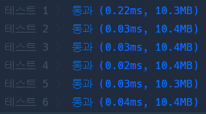

# Python 

## pro level3 프린터

https://programmers.co.kr/learn/courses/30/lessons/42628

> 


* 문제

  > 

* 입력

  > 
  >
  > ```bash
  > 
  > ```
  
* 출력

  > 
  >
  > ```bash
  > 
  > ```


```python
from heapq import heappush, heappop

def solution(operations):
    maxheap, minheap, check = [], [], {}
    
    for o in operations:
        oper, num = o.split()
        num = int(num)
        
        if oper == 'I':
            if num in check:
                check[num] += 1
            else:
                check[num] = 1
            heappush(minheap, num)
            heappush(maxheap, -num)
        else:
            if num == 1:
                while maxheap:
                    if -maxheap[0] in check:
                        if 1 < check[-maxheap[0]]:
                            check[-maxheap[0]] -= 1
                        else:
                            check.pop(-maxheap[0])
                        break
                    else:
                        heappop(maxheap)
            else:
                while minheap:
                    if minheap[0] in check:
                        if 1 < check[minheap[0]]:
                            check[minheap[0]] -= 1
                        else:
                            check.pop(minheap[0])
                        break
                    else:
                        heappop(minheap)
    
    while maxheap:
        if -maxheap[0] in check:
            break
        else:
            heappop(maxheap)
    while minheap:
        if minheap[0] in check:
            break
        else:
            heappop(minheap)
            
    answer = [0, 0]
    if maxheap:
        answer[0] = -maxheap[0]
    if minheap:
        answer[1] = minheap[0]
        
    return answer
```

>불과 며칠 전에 풀어봤던 건데, 해쉬 값을 쓰지 않고 인덱스 값을 쓰면 더 시간이 오래 걸림을 깨달았다. 그래서 이번엔 해시값을 써서 풀어 보려고 노력을 하였다.


* 모범답안

  

  ```python
  from heapq import heappush, heappop
  
  def solution(arguments):
      max_heap = []
      min_heap = []
      for arg in arguments:
          if arg == "D 1":
              if max_heap != []:
                  heappop(max_heap)
                  if max_heap == [] or -max_heap[0] < min_heap[0]:
                      min_heap = []
                      max_heap = []
          elif arg == "D -1":
              if min_heap != []:
                  heappop(min_heap)
                  if min_heap == [] or -max_heap[0] < min_heap[0]:
                      max_heap = []
                      min_heap = []
          else:
              num = int(arg[2:])
              heappush(max_heap, -num)
              heappush(min_heap, num)
      if min_heap == []:
          return [0, 0]
      return [-heappop(max_heap), heappop(min_heap)]
  ```

  > 이건 솔직히 이해를 못하겠는데 대각선으로 교차되어 저장되는 maxheap과 minheap의 성질을 이용한듯. 만약 한쪽만 계속 popㅔ되었을 때 아 모르겠다 현재 최대힙 0인덱스가 최소힙 0인덱스보다 작다는 건 더이상 겹치는 부분이 없다는 얘기이기에 []으로 바꿔 주는 듯. 모르겠당

