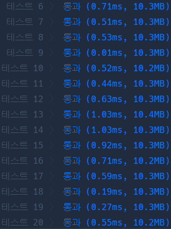

# Python 

## pro level2 압축

https://programmers.co.kr/learn/courses/30/lessons/17684

> 


* 문제

  > 

* 입력

  > 
  >
  > ```bash
  > 
  > ```
  
* 출력

  > 
  >
  > ```bash
  > 
  > ```


```python
def solution(msg):
    answer = []
    alphabet = {'A':1, 'B':2, 'C':3, 'D': 4, 'E': 5, 'F':6, 'G':7, 'H':8, 'I': 9, 'J': 10, 'K' : 11, 'L' : 12, 'M' : 13, 'N' : 14, 'O' : 15, 'P' : 16, 'Q': 17, 'R' : 18, 'S' : 19, 'T' : 20, 'U' : 21, 'V' : 22, 'W' : 23, 'X' : 24, 'Y' : 25, 'Z' : 26}
    index, i, flag = 27, 0, 0
    while i < len(msg):
        tmp, idx = msg[i], 1
        while tmp in alphabet:
            if i + idx >= len(msg):
                flag = 1
                break
            tmp += msg[i + idx]
            idx += 1
        if flag:
            answer.append(alphabet[tmp])
            i += len(tmp)
        else:
            if len(tmp) != 1:
                answer.append(alphabet[tmp[:-1]])
                i = i + len(tmp)-1
            else:
                answer.append(alphabet[tmp])
                i += 1
            print(tmp)
            alphabet[tmp] = index
            index += 1
    return answer

'''
A AB = 27
B BA = 28
ABA = 29
BAB = 30

'''
```

> while문으로 하지 말고 모범 답안처럼 msg의 앞을 줄여나가며 코드를 짜는 게 더 효율적이었을듯.


* 모범답안

  ```python
  def solution(msg):
      answer = []
      tmp = {chr(e + 64): e for e in range(1, 27)}
      num = 27
      while msg:
          tt = 1
          while msg[:tt] in tmp.keys() and tt <= msg.__len__():
              tt += 1
          tt -= 1
          if msg[:tt] in tmp.keys():
              answer.append(tmp[msg[:tt]])
              tmp[msg[:tt + 1]] = num
              num += 1
          msg = msg[tt:]
      return answer
  ```

  > 아 chr이게 기억이 안나서 하나 하나 다 선언했었다.
  >
  > 만약 a = chr(65) 라고 한다면 a = 'A'가 나옴.

