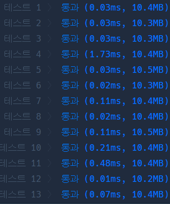

# Python 

## pro level2 뉴스 클러스터링

https://programmers.co.kr/learn/courses/30/lessons/17677


> 


* 문제

  > 

* 입력

  > 
  >
  > ```bash
  > 
  > ```
  
* 출력

  > 
  >
  > ```bash
  > 
  > ```


```python
'''
aaabb aaaabb

aa, aa1, ab, bb
aa, aa1, aa2, ab, bb
'''

def solution(str1, str2):
    str1, str2 = str1.lower(), str2.lower()
    st1, st2, dic1, dic2 = [], [], {}, {}
    
    for i in range(len(str1)-1):
        tmp = str1[i] + str1[i+1]
        
        if tmp.isalpha():
            if tmp in dic1:
                st1.append(tmp+str(dic1[str(tmp)]))
                dic1[str(tmp)] += 1
            else: 
                st1.append(tmp)
                dic1[str(tmp)] = 1
                
    for i in range(len(str2)-1):
        tmp = str2[i] + str2[i+1]
        
        if tmp.isalpha():
            if tmp in dic2:
                st2.append(tmp+str(dic2[str(tmp)]))
                dic2[str(tmp)] += 1
            else: 
                st2.append(tmp)
                dic2[str(tmp)] = 1
                
    st1, st2 = set(st1), set(st2)
    return 65536 if len(st1 | st2) == 0 else int((len(st1 & st2) / len(st1 | st2)) * 65536)
```

> - lower()
>   - 알파벳이 아닌 문자가 있더라도 싹 다 소문자로 바꿔줌
> - 합집합
>   - |, s1.union(s2)
>     - set만 됨
> - 곱집합
>   - &, s1.intersection(s2)
>     - set만 됨
>
> 매개 변수들을 돌리며 2글자 씩 뽑아낸다. 뽑아낸 글자들이 중복값인지 확인함. 만약 중복값이라면 문자를 하나 더 붙여서 append함.


* 모범답안

  ```python
  def solution(str1, str2):
  
      list1 = [str1[n:n+2].lower() for n in range(len(str1)-1) if str1[n:n+2].isalpha()]
      list2 = [str2[n:n+2].lower() for n in range(len(str2)-1) if str2[n:n+2].isalpha()]
  
      tlist = set(list1) | set(list2)
      res1 = [] #합집합
      res2 = [] #교집합
  
      if tlist:
          for i in tlist:
              res1.extend([i]*max(list1.count(i), list2.count(i)))
              res2.extend([i]*min(list1.count(i), list2.count(i)))
  
          answer = int(len(res2)/len(res1)*65536)
          return answer
  
      else:
          return 65536
  ```

  > 하여간 배울 점이 엄청 많은 코드라는 건 알겠는데 시간 효율성은 영 엉망이다.
  >
  > max로 해당 리스트에 해당 문자열 개수를 탐색하여 합집합을 만들고
  >
  > min으로 곱집합을 만듦.

