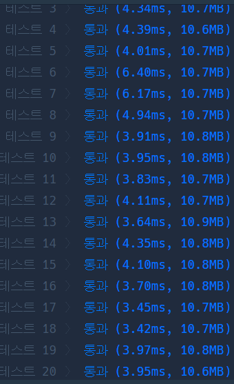

# Python 

## pro level3 불량 사용자

https://programmers.co.kr/learn/courses/30/lessons/64064

> 


* 문제

  > 

* 입력

  > 
  >
  > ```bash
  > 
  > ```
  
* 출력

  > 
  >
  > ```bash
  > 
  > ```


```python
def solution(files):
    answer, res = [], []

    for f in range(len(files)):
        head, number, tail = '', '', ''
        idx = 0

        # 숫자가 나오기 전까지
        while not files[f][idx].isdigit():
            head += files[f][idx]
            idx += 1
            
        # *현재 인덱스가 작은 동안에, 그리고 숫자인 동안에
        while idx < len(files[f]) and files[f][idx].isdigit():
            number += files[f][idx]
            idx += 1
        # 0으로 채워줌
        zfillnumber = number.rjust(5, '0')

        # 아직 길이가 남아있다면 tail에 넣어줌
        if idx < len(files[f]):
            tail = files[f][idx:]

        answer.append([head.lower(), zfillnumber, f, head, number, tail])

    answer.sort(key=lambda x: (x[0], x[1], f))

    for i in range(len(answer)):
        tmp = ''
        for j in range(3, len(answer[i])):
            tmp += answer[i][j]
        res.append(tmp)

    return res
```

>아놩 ㅋ 빡쳐 ㅠ 이걸 왜 어렵다고 생각하고 안풀었지? 생각의 흐름을 거슬러 올라가자면,, 숫자에 zfill로 자리수를 맞추면 이전 숫자는 다른 배열에 저장해야하나? 라고 생각했던 것 같다. 이건 그냥,, 배열에 저장할 때 같이 저장하고 정렬만 zfill 인덱스로만 정렬하면 된다. 그리고 나중에 문자열로 합칠 때는 기존의 숫자로 문자열을 만들면 됨,, 바보 아니냐? ㅠㅠ


* 모범답안

  

  ```python
  
  ```

  > 

