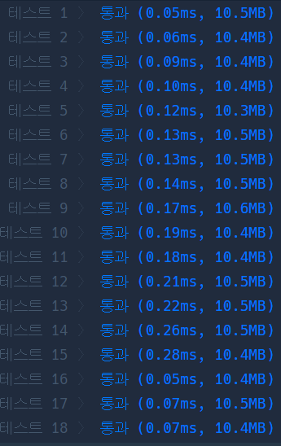

# Python

## pro level2 수식 최대화

https://programmers.co.kr/learn/courses/30/lessons/67257


> 


* 문제

  > 

* 입력

  > 
  >
  > ```bash
  > 
  > ```
  
* 출력

  > 
  >
  > ```bash
  > 
  > ```


```python
def plus(arr):      # plus
    arr2 = []
    idx = 0
    while idx < len(arr):
        if arr[idx] == '+':   # plus면 계산한 값을 넣어준다.
            arr2[-1] = (str(int(arr2[-1])+int(arr[idx + 1])))
            idx += 1
        else:
            arr2.append(arr[idx])   # 그 외 연산이거나 숫자면
        idx += 1
    return arr2


def minus(arr):
    arr2 = []
    idx = 0
    while idx < len(arr):
        if arr[idx] == '-':
            arr2[-1] = (str(int(arr2[-1])-int(arr[idx + 1])))
            idx += 1
        else:
            arr2.append(arr[idx])
        idx += 1
    return arr2


def mul(arr):
    arr2 = []
    idx = 0
    while idx < len(arr):
        if arr[idx] == '*':
            arr2[-1] = (str(int(arr2[-1])*int(arr[idx + 1])))
            idx += 1
        else:
            arr2.append(arr[idx])
        idx += 1
    return arr2


def solution(expression):
    arr = []
    tmp = ''
    for i in expression:
        if i.isdigit():
            tmp += i
        else:
            arr.append(tmp)
            tmp = ''
            arr.append(i)
    arr.append(tmp)
    answer = max(abs(int(plus(minus(mul(arr)))[0])), abs(int(plus(mul(minus(arr)))[0])),
                abs(int(minus(plus(mul(arr)))[0])), abs(int(minus(mul(plus(arr)))[0])),
                abs(int(mul(plus(minus(arr)))[0])), abs(int(mul(minus(plus(arr)))[0])))

    return answer


print(solution("100-200*300-500+20"))
```

> 


* 모범답안

  ```python
  def solution(expression):
      operations = [('+', '-', '*'),('+', '*', '-'),('-', '+', '*'),('-', '*', '+'),('*', '+', '-'),('*', '-', '+')]
      answer = []
      for op in operations:
          a = op[0]
          b = op[1]
          temp_list = []
          for e in expression.split(a):
              temp = [f"({i})" for i in e.split(b)]
              temp_list.append(f'({b.join(temp)})')
          answer.append(abs(eval(a.join(temp_list))))
      return max(answer)
  ```

  > 이거 개쩌는데 왜 나보다 더 시간이 오래걸리지
  >
  > 딱히 모르는 건 없는데 이걸 어떻게 생각했나 싶은 풀이,, 멋지다

