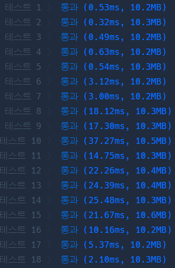

# Python

## pro level2 메뉴 리뉴얼

https://programmers.co.kr/learn/courses/30/lessons/72411


> 


* 문제

  > 

* 입력

  > 
  >
  > ```bash
  > 
  > ```
  
* 출력

  > 
  >
  > ```bash
  > 
  > ```


```python
from itertools import combinations
from collections import defaultdict


def solution(orders, course):
    answer = []
    cancourse = defaultdict(int)    # 코스요리의 후보군을 저장하는 해쉬맵
    countcourse = {}    # {2:0, 3:0, 5:0} course를 바탕으로 정렬
    for c in course:
        countcourse[c] = 0
        # 초기화
    for i in range(len(orders)):
        # 주문들을 돌면서
        for j in range(len(course)):
            # 요리 개수 대로
            for comb in combinations(orders[i], course[j]):
                # 조합을 만듦. abcfg라면 ab ac af ...
                if ''.join(sorted(list(comb))) not in cancourse:
                    # ('A', 'B')와 같은 형태로 조합되기에
                    # 우선 정렬을 해준다음, 'AB'형태로 바꿔줌
                    # 이게 이미 세어봤던 코스 요리 조합이 아니라면
                    for k in range(i+1, len(orders)):
                        tmp = 0
                        for c in comb:
                            if c in orders[k]:
                                tmp += 1
                        if tmp == len(comb):
                            cancourse[''.join(sorted(list(comb)))] += 1
                        if cancourse[''.join(sorted(list(comb)))] > countcourse[len(comb)]:
                            countcourse[len(comb)] = cancourse[''.join(sorted(list(comb)))]
                            # 개수를 센다음
                            # 그 코스요리 개수의 최댓값이라면 그 개수를 갱신해줌
                            # 예를 들어 'AB'가 2명의 손님으로부터 주문을 받았는데
                            # 'AC'는 3명의 손님으로부터 주문을 받았다면
                            # course[2]는 2가 아닌 3으로 갱신해줘야함.
    for key, value in cancourse.items():
        if countcourse[len(key)] != 0 and countcourse[len(key)] == value:
            # 현재 최댓값을 지닌 코스요리라면
            answer.append(key)
            # 답 배열에 넣고
    answer.sort()
    # 정렬해준 다음 종료.
                        
    return answer
```

> 이게 어렵다기 보다 헷갈렸던 거는 `경출도` 때문이었다. 순서를 다르게 해도 괜찮지 않을까라는 생각에 출경도로 했다가 틀려버렸다. 이유는 뭔지 모르겠는데 ㅠㅠ 그냥 경출도 순서로 포문을 이해하는 게 낫겠다.
>
> 그리고 마지막 거리는 출발에서 셋의 중앙 정점, 셋의 중앙정점에서 a와 b


* 모범답안

  ```python
  import collections
  import itertools
  
  def solution(orders, course):
      result = []
  
      for course_size in course:
          order_combinations = []
          for order in orders:
              order_combinations += itertools.combinations(sorted(order), course_size)
              
          most_ordered = collections.Counter(order_combinations).most_common()
          print(most_ordered)
          result += [ k for k, v in most_ordered if v > 1 and v == most_ordered[0][1] ]
  
      return [ ''.join(v) for v in sorted(result) ]
  ```
  
  > - `most_ordered = collections.Counter(order_combinations).most_common()`
  >
  > - orders = `["ABCFG", "AC", "CDE", "ACDE", "BCFG", "ACDEH"]`
  > - course = [2, 3, 4]
  >
  > [(('A', 'C'), 4), (('C', 'D'), 3), (('C', 'E'), 3), (('D', 'E'), 3), (('B', 'C'), 2), (('B', 'F'), 2), (('B', 'G'), 2), (('C', 'F'), 2), (('C', 'G'), 2), (('F', 'G'), 2), (('A', 'D'), 2), (('A', 'E'), 2), (('A', 'B'), 1), (('A', 'F'), 1), (('A', 'G'), 1), (('A', 'H'), 1), (('C', 'H'), 1), (('D', 'H'), 1), (('E', 'H'), 1)]
  > [(('C', 'D', 'E'), 3), (('B', 'C', 'F'), 2), (('B', 'C', 'G'), 2), (('B', 'F', 'G'), 2), (('C', 'F', 'G'), 2), (('A', 'C', 'D'), 2), (('A', 'C', 'E'), 2), (('A', 'D', 'E'), 2), (('A', 'B', 'C'), 1), (('A', 'B', 'F'), 1), (('A', 'B', 'G'), 1), (('A', 'C', 'F'), 1), (('A', 'C', 'G'), 1), (('A', 'F', 'G'), 1), (('A', 'C', 'H'), 1), (('A', 'D', 'H'), 1), (('A', 'E', 'H'), 1), (('C', 'D', 'H'), 1), (('C', 'E', 'H'), 1), (('D', 'E', 'H'), 1)]
  > [(('B', 'C', 'F', 'G'), 2), (('A', 'C', 'D', 'E'), 2), (('A', 'B', 'C', 'F'), 1), (('A', 'B', 'C', 'G'), 1), (('A', 'B', 'F', 'G'), 1), (('A', 'C', 'F', 'G'), 1), (('A', 'C', 'D', 'H'), 1), (('A', 'C', 'E', 'H'), 1), (('A', 'D', 'E', 'H'), 1), (('C', 'D', 'E', 'H'), 1)]
  >
  > 하,, 진짜 개쩐다,,,
  >
  > - `Counter` : collections 내장함수인 counter는 각각의 인자에 해당글자가 몇 개 들어가 있는지 세어 준다.
  >   - ` most_common()` : 이때 들어간 most_common()함수는 최다 글자 개수 차순으로 정렬해줌.

