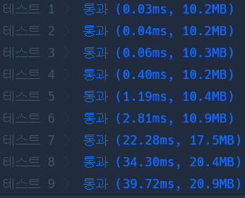

# Python 

## pro level3 가장 먼 노드

https://programmers.co.kr/learn/courses/30/lessons/49189

> 


* 문제

  > 

* 입력

  > 
  >
  > ```bash
  > 
  > ```
  
* 출력

  > 
  >
  > ```bash
  > 
  > ```


```python
from collections import deque

def solution(n, edge):
    answer = 0
    arr = [float('inf')] * (n+1)
    arr[0], arr[1] = 0, 0
    move = [[] for _ in range(n+1)]
    
    for n1, n2 in edge:
        move[n1].append(n2)
        move[n2].append(n1)
        
    q = deque([[1, 0]])
    
    while q:
        node, cnt = q.popleft()
        
        for n in range(len(move[node])):
            if cnt + 1 < arr[move[node][n]]:
                arr[move[node][n]] = cnt+1
                q.append([move[node][n], cnt+1])
    
    max_v = max(arr)
    for a in arr:
        if max_v == a:
            answer += 1
    
    return answer
```

>참,,,,나,,, 고작 이 아이디어가 빠릿빠릿하게 생각이 안나서 한 삼 십분 뒹굴 뒹굴한 것 같다.. 어떻게 풀어야 하지, 노드가 20000개면 이차원 배열도 안된다는 얘기인데,, 유니온 파인드로 부모노드를 맞춰줘야 하나? 이런 식으로 다양한 생각을 하다가 누워서 강아지랑 노는데 갑자기 생각 났다. 1에서 모든 노드로 가는 1차원 배열을 만들어주고(무한대 값으로 초기화), 각 노드에서 방문 가능한 노드를 2차원 배열로 만들어줌.
>
>그리고 bfs로 돌면서 1에서부터의 각 노드의 최단 거리를 갱신해 준다.


- 엄청난 재귀의 압박으로 런타임 에러를 받은 코드

```python
import sys
sys.setrecursionlimit(10000)

def solution(n, edge):
    answer = 0
    arr = [float('inf')] * (n+1)
    arr[0], arr[1] = 0, 0
    move = [[] for _ in range(n+1)]
    for n1, n2 in edge:
        move[n1].append(n2)
        move[n2].append(n1)
    
    def dfs(node, cnt):
        for n in range(len(move[node])):
            if cnt + 1 < arr[move[node][n]]:
                arr[move[node][n]] = cnt+1
                dfs(move[node][n], cnt+1)
                
    dfs(1, 0)
    
    max_v = max(arr)
    for a in arr:
        if max_v == a:
            answer += 1
    
    return answer
```

> 흠,,, 나는 bfs보다 dfs가 먼저 떠올라서 dfs로 풀었는데 런타임 에러를 만났다. 도무지 왜 런타임 에러가 나는지 이해 못해서 좀 찾았는데.. 백준에서 누군가 recursionerror도 런타임에러라고 말하는 걸 보았다. 그래서 limit을 걸었다. 하지만 시간초과로 fail ㅠㅠ 


* 모범답안

  ```python
  
  ```

  > 

