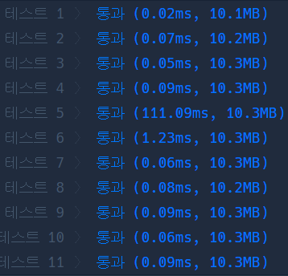

# Python 

## pro level3 불량 사용자

https://programmers.co.kr/learn/courses/30/lessons/64064

> 


* 문제

  > 

* 입력

  > 
  >
  > ```bash
  > 
  > ```
  
* 출력

  > 
  >
  > ```bash
  > 
  > ```


```python
answer, li = set(), []


def solution(user_id, banned_id):
    arr = [[] for _ in range(len(banned_id))]

    # 모든 불량 아이디를 for문으로 돌리면서
    for b in range(len(banned_id)):
        # 불량아이디의 순수 알파벳 개수를 저장
        alphacnt = len(banned_id[b]) - banned_id[b].count('*')

        # 유저 아이디를 완탐하며
        for u in range(len(user_id)):
            # 현재 불량아디와 유저 아이디의 길이가 같지 않은 건 넘어가고
            if len(banned_id[b]) != len(user_id[u]):
                continue

            cnt = 0
            # 유저 아이디와 불량아이디 체크
            for i in range(len(user_id[u])):
                if banned_id[b][i] == '*':
                    continue
                if banned_id[b][i] == user_id[u][i]:
                    cnt += 1
            # 2차원 배열에, 현재 불량아이디의 후보가 될 수 있는 아이디를
            # 배열에 push해줌
            if cnt == alphacnt:
                arr[b].append(user_id[u])

    # dfs로 방문하며
    def dfs(cnt, idlist):

        # 모든 경우의 수를 다 체크했을 때
        if cnt == len(arr):
            # 정렬한 다음 set방식으로 결과에 add해줌
            tmpidlist = sorted(idlist)
            answer.add(tuple(tmpidlist))
            return
        
        # 경우의 수를 하나 씩 돌며 dfs로 방문
        for i in range(len(arr[cnt])):
            if arr[cnt][i] not in idlist:
                idlist.append(arr[cnt][i])
                dfs(cnt + 1, idlist)
                idlist.pop()

    dfs(0, [])

    return len(answer)
```

>아 이거 완조니,, 발로도 풀 수 있는 문젠데 아침엔 진짜 잠이 안깨는 건가? 아니면 오늘 아침엔 컨디션이 안좋았나? 마음만 급급하고 문제는 눈에 안들어 와서 결국 제시간에 못 풀었다. 나는 왜이렇게 매일 매일 기복이 심할까 ㅜㅜ 기복을 줄이는 게 좋겠다.
>
>그리고 여기서 한 가지 헷갈렸던 것은 tmpidlist = sorted(idlist) 이부분이다.
>
>dfs로 돌더라도 idlist.sort()를 하면 idlist의 메모리에 접근하는 것이기 때문에 이전 dfs로 돌아와도 이전 결과값이 아닌 정렬된 list에서 pop을 해주는 것이 된다. 고로, 그  풀이는 틀렸음..
>
>그리고 메모리에 append해주는 거니까 push한 걸 pop해 주ㅓ야 하는 것도 맞음


* 모범답안

  

  ```python
  
  ```

  > 

